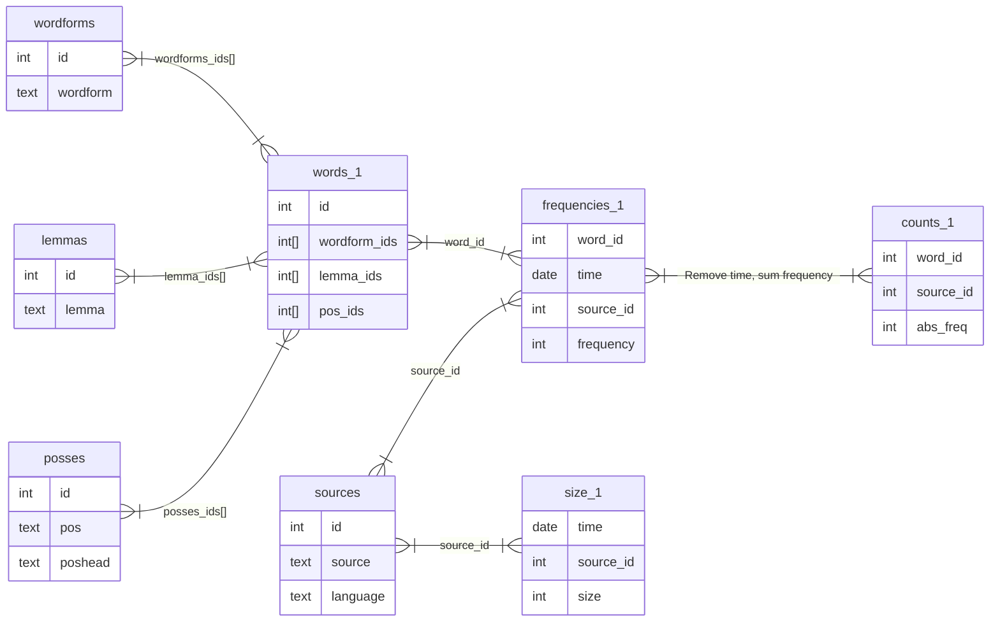

# Woordpeiler Database

## Schema

## Initialisating/updating the database
Because this project is designed to be updated weekly while the database from the previous week is still running, we have two psql docker containers.
The 'production' container is called `database`. The other, used to prepare next weeks data, is called `builder`. They are identical psql containers in every regard, other than that they point to a different docker volume. To initialize a new database:

1. Obtain frequency data from a [BlackLab](https://github.com/instituutnederlandsetaal/blacklab) corpus using the BlackLab FrequencyTool. This will output TSV. Use `scripts/FrequencyTool/woordpeiler.yaml` as an example for the FrequencyTool config.
2. Fill in the `.env`. (See `readme.md` at the root.)
3. `scripts/create-database.sh [path to tsv data]` and wait for it to finish. This uses the `builder` container.
4. Now, edit `.env` to point to the new volume (see output of previous command) and (re)launch the `database` container: `docker compose up database -d --force-recreate`.

### FrequencyTool
The frequency tool, when used with `woordpeiler.yaml`, will output the following files, that are required by the database builder:

- unigram_word.tsv (table `wordforms`)
- unigram_lemma.tsv (table `lemmas`)
- unigram_pos.tsv (table `posses`)
- unigram_metadata.tsv (table `sources`)
- unigram_annotations.tsv (table `words_1`)
- unigram_size.tsv (table `size_1`)
- unigram.tsv (table `frequencies_1`)
- and more for bigrams, etc.
